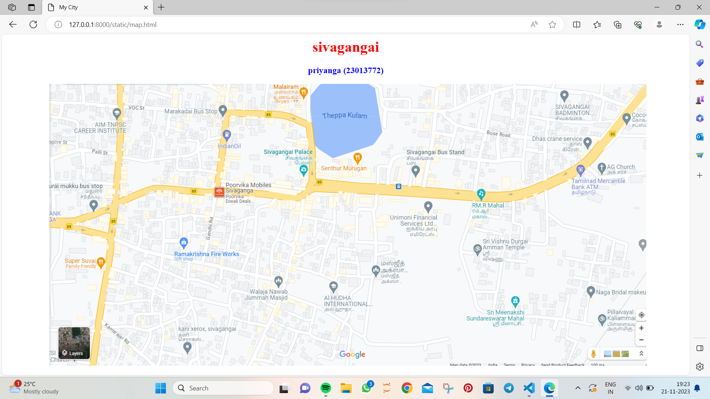
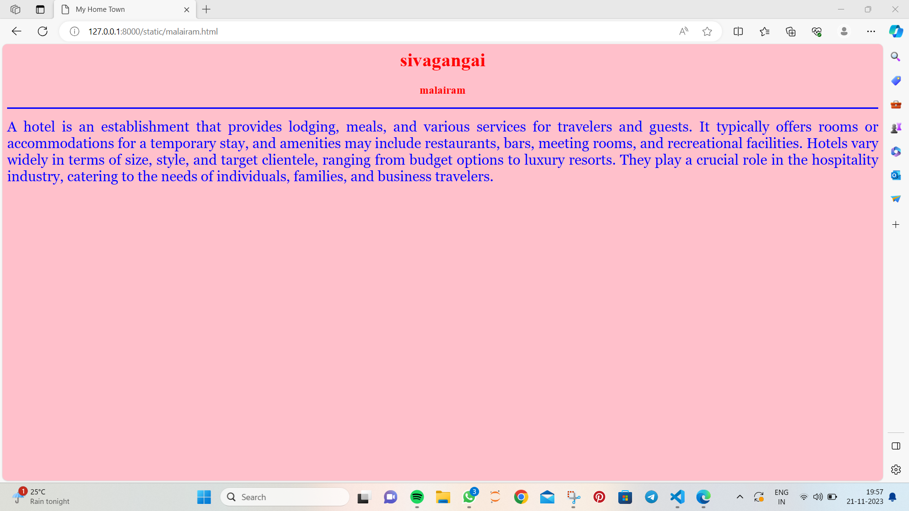
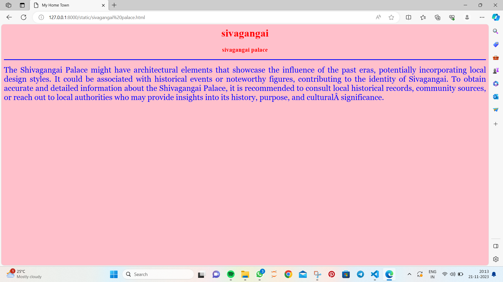
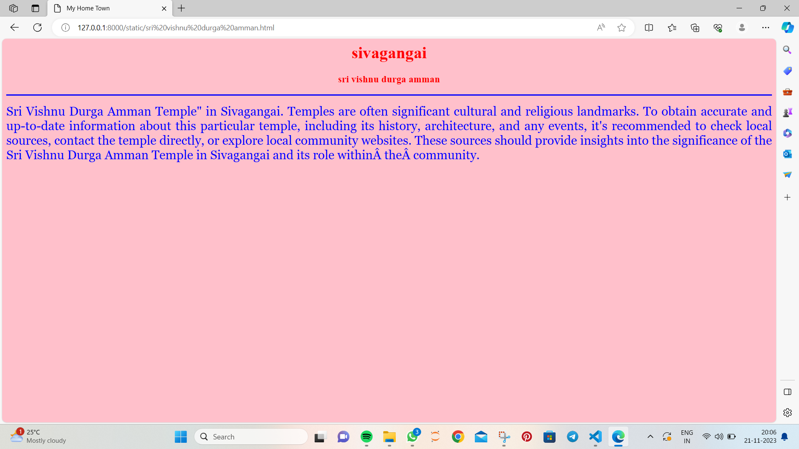
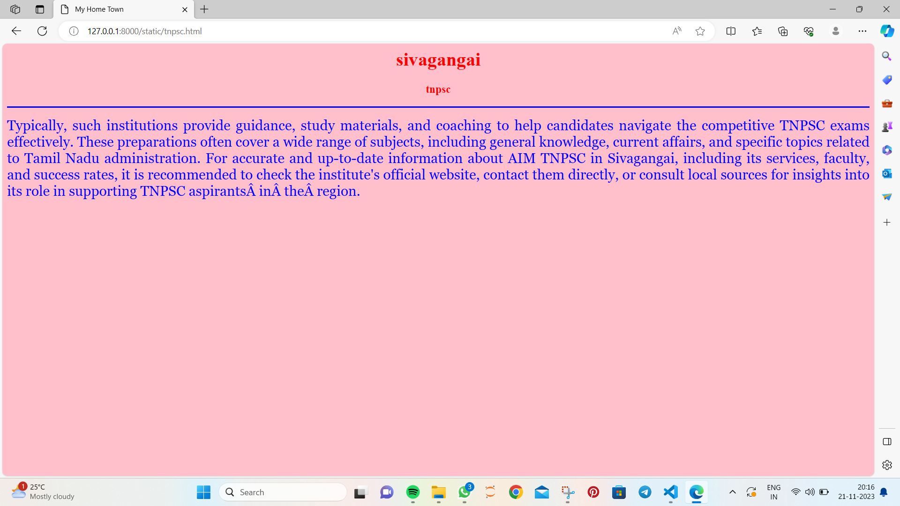

# Ex04 Places Around Me
## Date: 21.11.2023

## AIM
To develop a website to display details about the places around my house.

## DESIGN STEPS

### STEP 1
Create a Django admin interface.

### STEP 2
Download your city map from Google.

### STEP 3
Using ```<map>``` tag name the map.

### STEP 4
Create clickable regions in the image using ```<area>``` tag.

### STEP 5
Write HTML programs for all the regions identified.

### STEP 6
Execute the programs and publish them.

## CODE
```
map.html

<html>
<head>
<title>My City</title>
</head>
<body>
<h1 align="center">
<font color="red"><b>sivagangai</b></font>
</h1>
<h3 align="center">
<font color="blue"><b>priyanga (23013772)</b></font>
</h3>
<center>

<map name="MyCity">
<area shape="RECT" coords="580,02,750,180" href="theppa kulam.html" title="theppa kulam">
<area shape="RECT" coords="900,300,1050,400" href="sri vishnu durga amman.html" title="sri vishnu durga amman">
<area shape="RECT" coords="450,120,600,200" href="sivagangai palace.html" title="sivagangai palace">
<area shape="RECT" coords="50,50,180,120" href="tnpsc.html" title="aim tnpsc career institution">
<area shape="RECT" coords="480,02,570,50" href="malairam.html" title="malairam">
</map>
</center>
</body>
</html>

malairam.html

<html>
<head>
<title>My Home Town</title>
</head>
<body bgcolor="pink">
<h1 align="center">
<font color="red"><b>sivagangai</b></font>
</h1>
<h3 align="center">
<font color="red"><b>malairam</b></font>
</h3>
<hr size="3" color="blue">
<p align="justify">
<font face="Georgia" size="5" color="blue">
    A hotel is an establishment that provides lodging, meals, and various services for travelers and guests. It typically offers rooms or accommodations for a temporary stay, and amenities may include restaurants, bars, meeting rooms, and recreational facilities. Hotels vary widely in terms of size, style, and target clientele, ranging from budget options to luxury resorts. They play a crucial role in the hospitality industry, catering to the needs of individuals, families, and business travelers. 
</font>
</p>
</body>
</html>

sivagangai palace.html

<html>
<head>
<title>My Home Town</title>
</head>
<body bgcolor="pink">
<h1 align="center">
<font color="red"><b>sivagangai</b></font>
</h1>
<h3 align="center">
<font color="red"><b>sivagangai palace</b></font>
</h3>
<hr size="3" color="blue">
<p align="justify">
<font face="Georgia" size="5" color="blue">

The Shivagangai Palace might have architectural elements that showcase the influence of the past eras, potentially incorporating local design styles. It could be associated with historical events or noteworthy figures, contributing to the identity of Sivagangai. To obtain accurate and detailed information about the Shivagangai Palace, it is recommended to consult local historical records, community sources, or reach out to local authorities who may provide insights into its history, purpose, and cultural significance.
</font>
</p>
</body>
</html>

sri vishnu durga amman.html

<html>
<head>
<title>My Home Town</title>
</head>
<body bgcolor="pink">
<h1 align="center">
<font color="red"><b>sivagangai</b></font>
</h1>
<h3 align="center">
<font color="red"><b>sri vishnu durga amman</b></font>
</h3>
<hr size="3" color="blue">
<p align="justify">
<font face="Georgia" size="5" color="blue">
    Sri Vishnu Durga Amman Temple" in Sivagangai. Temples are often significant cultural and religious landmarks. To obtain accurate and up-to-date information about this particular temple, including its history, architecture, and any events, it's recommended to check local sources, contact the temple directly, or explore local community websites. These sources should provide insights into the significance of the Sri Vishnu Durga Amman Temple in Sivagangai and its role within the community.
</font>
</p>
</body>
</html>

theppa kulam.html

<html>
<head>
<title>My Home Town</title>
</head>
<body bgcolor="pink">
<h1 align="center">
<font color="red"><b>sivagangai</b></font>
</h1>
<h3 align="center">
<font color="red"><b>theppa kulam</b></font>
</h3>
<hr size="3" color="blue">
<p align="justify">
<font face="Georgia" size="5" color="blue">

If there is a specific "Theppa Kulam" in Sivagangai, it could be a place of spiritual importance and communal gatherings. The pond may play a role in religious festivals, providing a serene setting for traditional activities. Its waters might be considered sacred, contributing to the cultural heritage of the region. To learn more about the history, rituals, and cultural significance of Theppa Kulam in Sivagangai, it is recommended to consult local sources, community records, or reach out to the concerned authorities.
</font>
</p>
</body>
</html>

tnpsc.html

<html>
<head>
<title>My Home Town</title>
</head>
<body bgcolor="pink">
<h1 align="center">
<font color="red"><b>sivagangai</b></font>
</h1>
<h3 align="center">
<font color="red"><b>tnpsc</b></font>
</h3>
<hr size="3" color="blue">
<p align="justify">
<font face="Georgia" size="5" color="blue">
Typically, such institutions provide guidance, study materials, and coaching to help candidates navigate the competitive TNPSC exams effectively. These preparations often cover a wide range of subjects, including general knowledge, current affairs, and specific topics related to Tamil Nadu administration.

For accurate and up-to-date information about AIM TNPSC in Sivagangai, including its services, faculty, and success rates, it is recommended to check the institute's official website, contact them directly, or consult local sources for insights into its role in supporting TNPSC aspirants in the region.
</font>
</p>
</body>
</html>
```

## OUTPUT








## RESULT
The program for implementing image maps using HTML is executed successfully.
